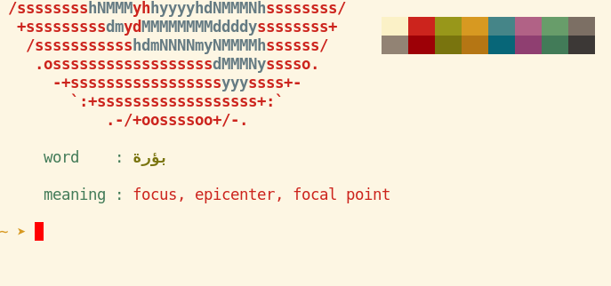

# Terminal flashcards

A simple script to show a flashcard in the Linux terminal as it opens. It is a simplified version of [Sudocabulary](https://github.com/badarsh2/Sudocabulary) with a solution for custom decks.



The sample deck is one I made long ago for Arabic-English vocab learning, but the script can be used for any content. Just put tab-separated pairs of expressions in a text file, like so:

```
house   maison
car     voiture
apple   pomme
```

A quick way to get ready-made decks is to download one from [AnkiWeb](https://ankiweb.net/shared/decks/) and export it to a text file in the AnkiWeb [desktop app](https://apps.ankiweb.net). Exported Ankiweb files can be used in this script as they are. 

## Installation

1) Clone the repository.
2) Put your deck file in the `./decks` folder (or somewhere else).
3) Open `vocab.sh` in a text editor and insert the path to your deck file after `MYDECK=`.
4) Add the path to `vocab.sh` at the end of your `~/.bashrc` or `~/.zshrc` file.
5) Open or refresh your terminal.

The script can be easily modified to show more than one card either from the same or from different decks.


